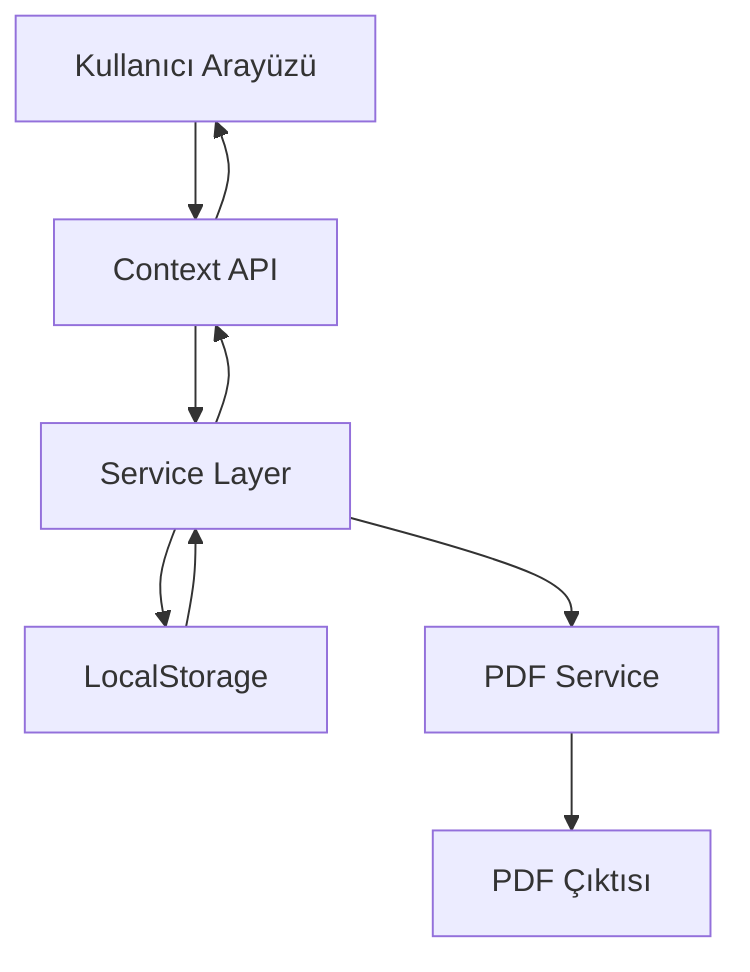

# Tasarım Dokümanı

## Genel Bakış

Sipariş Yönetim Sistemi, malzeme satan firmalar için tasarlanmış bir web uygulamasıdır. Sistem, kullanıcıların cari seçmesine, ürün eklemesine, sipariş oluşturmasına, PDF çıktısı almasına ve siparişleri satışa dönüştürmesine olanak tanır.

### Teknoloji Yığını

- **Frontend Framework**: React 18+ (TypeScript)
- **UI Kütüphanesi**: Tailwind CSS
- **PDF Oluşturma**: jsPDF + jspdf-autotable
- **Veri Yönetimi**: React Context API
- **Veri Saklama**: LocalStorage (ilk aşama) / REST API (gelecek)
- **Form Yönetimi**: React Hook Form
- **Routing**: React Router v6

## Mimari

### Katmanlı Mimari

```
┌─────────────────────────────────────┐
│     Presentation Layer (UI)         │
│  - Components (Pages, Forms, Lists) │
│  - Hooks (Custom React Hooks)       │
└─────────────────────────────────────┘
              ↓
┌─────────────────────────────────────┐
│     Business Logic Layer            │
│  - Context Providers                │
│  - Services (PDF, Calculations)     │
└─────────────────────────────────────┘
              ↓
┌─────────────────────────────────────┐
│     Data Access Layer               │
│  - LocalStorage Repository          │
│  - Data Models & Types              │
└─────────────────────────────────────┘
```

### Veri Akışı



## Bileşenler ve Arayüzler

### Ana Bileşenler

#### 1. App Component
- Routing yapısını yönetir
- Global context provider'ları içerir
- Ana layout'u sağlar

#### 2. Sipariş Oluşturma Sayfası (OrderCreatePage)
- Cari seçim bileşeni
- Ürün arama ve ekleme bileşeni
- Sipariş özet bileşeni
- Kaydet ve PDF oluştur butonları

**Alt Bileşenler:**
- `CariSelector`: Cari arama ve seçim dropdown
- `ProductSearch`: Ürün arama input ve sonuç listesi
- `OrderItemsList`: Seçilen ürünler tablosu
- `OrderSummary`: Ara toplam, KDV, genel toplam gösterimi
- `ActionButtons`: Kaydet, PDF, Temizle butonları

#### 3. Sipariş Listesi Sayfası (OrderListPage)
- Tüm siparişleri listeler
- Sipariş detaylarını gösterir
- Silme ve satışa dönüştürme işlemleri

**Alt Bileşenler:**
- `OrderTable`: Sipariş listesi tablosu
- `OrderRow`: Tek sipariş satırı
- `OrderActions`: Sil, Satışa Dönüştür, PDF butonları

#### 4. Satış Listesi Sayfası (SalesListPage)
- Satışa dönüştürülmüş siparişleri gösterir
- Satış raporları ve özet bilgiler

#### 5. Cari Yönetimi Sayfası (CariManagementPage)
- Cari ekleme, düzenleme, silme
- Cari listesi

#### 6. Ürün Yönetimi Sayfası (ProductManagementPage)
- Ürün ekleme, düzenleme, silme
- Ürün listesi ve fiyat yönetimi

### Context Yapısı

#### OrderContext
```typescript
interface OrderContextType {
  currentOrder: Order | null;
  orders: Order[];
  createOrder: (order: Order) => void;
  updateOrder: (id: string, order: Order) => void;
  deleteOrder: (id: string) => void;
  convertToSale: (id: string) => void;
}
```

#### CariContext
```typescript
interface CariContextType {
  cariList: Cari[];
  addCari: (cari: Cari) => void;
  updateCari: (id: string, cari: Cari) => void;
  deleteCari: (id: string) => void;
  getCariById: (id: string) => Cari | undefined;
}
```

#### ProductContext
```typescript
interface ProductContextType {
  products: Product[];
  addProduct: (product: Product) => void;
  updateProduct: (id: string, product: Product) => void;
  deleteProduct: (id: string) => void;
  searchProducts: (query: string) => Product[];
}
```

#### SalesContext
```typescript
interface SalesContextType {
  sales: Sale[];
  getSaleById: (id: string) => Sale | undefined;
  getSalesByDateRange: (start: Date, end: Date) => Sale[];
}
```

## Veri Modelleri

### Cari (Müşteri)
```typescript
interface Cari {
  id: string;
  kod: string;
  ad: string;
  telefon?: string;
  email?: string;
  adres?: string;
  vergiNo?: string;
  createdAt: Date;
  updatedAt: Date;
}
```

### Ürün
```typescript
interface Product {
  id: string;
  kod: string;
  ad: string;
  birim: string; // adet, kg, m, m2, vb.
  birimFiyat: number;
  kdvOrani: number; // 0, 1, 8, 18, 20
  stokMiktari?: number;
  aciklama?: string;
  createdAt: Date;
  updatedAt: Date;
}
```

### Sipariş Kalemi
```typescript
interface OrderItem {
  id: string;
  productId: string;
  productKod: string;
  productAd: string;
  birim: string;
  miktar: number;
  birimFiyat: number;
  kdvOrani: number;
  satirToplam: number; // miktar * birimFiyat
  kdvTutar: number;
  genelToplam: number; // satirToplam + kdvTutar
}
```

### Sipariş
```typescript
interface Order {
  id: string;
  siparisNo: string; // SIP-2024-0001 formatında
  cariId: string;
  cariAd: string;
  items: OrderItem[];
  araToplam: number;
  toplamKdv: number;
  genelToplam: number;
  durum: 'taslak' | 'onaylandi' | 'satisa_dondu';
  notlar?: string;
  createdAt: Date;
  updatedAt: Date;
}
```

### Satış
```typescript
interface Sale {
  id: string;
  siparisId: string;
  siparisNo: string;
  satisNo: string; // SAT-2024-0001 formatında
  cariId: string;
  cariAd: string;
  items: OrderItem[];
  araToplam: number;
  toplamKdv: number;
  genelToplam: number;
  satisTarihi: Date;
  createdAt: Date;
}
```

## Servisler

### PDFService
PDF oluşturma işlemlerini yönetir.

**Metodlar:**
- `generateOrderPDF(order: Order, cari: Cari): void`
  - Sipariş bilgilerini PDF formatında oluşturur
  - Firma logosu ve bilgileri ekler
  - Ürün tablosu ve toplam bilgileri içerir
  - Otomatik indirir

### CalculationService
Hesaplama işlemlerini yönetir.

**Metodlar:**
- `calculateItemTotal(item: OrderItem): number`
- `calculateOrderTotals(items: OrderItem[]): { araToplam, toplamKdv, genelToplam }`
- `formatCurrency(amount: number): string`

### StorageService
LocalStorage işlemlerini yönetir.

**Metodlar:**
- `save<T>(key: string, data: T): void`
- `load<T>(key: string): T | null`
- `remove(key: string): void`
- `clear(): void`

### ValidationService
Form ve veri doğrulama işlemlerini yönetir.

**Metodlar:**
- `validateCari(cari: Cari): ValidationResult`
- `validateProduct(product: Product): ValidationResult`
- `validateOrder(order: Order): ValidationResult`

## Hata Yönetimi

### Hata Tipleri

```typescript
enum ErrorType {
  VALIDATION_ERROR = 'VALIDATION_ERROR',
  STORAGE_ERROR = 'STORAGE_ERROR',
  NOT_FOUND = 'NOT_FOUND',
  DUPLICATE = 'DUPLICATE',
  UNKNOWN = 'UNKNOWN'
}

interface AppError {
  type: ErrorType;
  message: string;
  details?: any;
}
```

### Hata Yönetim Stratejisi

1. **Validation Errors**: Form seviyesinde gösterilir, kullanıcı düzeltene kadar işlem yapılmaz
2. **Storage Errors**: Toast notification ile kullanıcıya bildirilir
3. **Not Found Errors**: Uygun mesaj ile kullanıcı yönlendirilir
4. **Duplicate Errors**: Kullanıcıya uyarı gösterilir, alternatif önerilir

### Error Boundary
React Error Boundary ile beklenmeyen hataları yakalar ve kullanıcı dostu mesaj gösterir.

## Test Stratejisi

### Unit Tests
- Service fonksiyonları (CalculationService, ValidationService)
- Utility fonksiyonları
- Custom hooks

### Integration Tests
- Context provider'lar ve state yönetimi
- Form submit işlemleri
- CRUD operasyonları

### Component Tests
- Kullanıcı etkileşimleri
- Form validasyonları
- Conditional rendering

### E2E Tests (Opsiyonel)
- Sipariş oluşturma akışı
- Satışa dönüştürme akışı
- PDF oluşturma

## Kullanıcı Arayüzü Tasarımı

### Sayfa Yapısı

```
┌─────────────────────────────────────────┐
│  Header (Logo, Navigasyon)              │
├─────────────────────────────────────────┤
│                                         │
│  Ana İçerik Alanı                       │
│                                         │
│                                         │
└─────────────────────────────────────────┘
```

### Navigasyon Menüsü
- Ana Sayfa
- Yeni Sipariş
- Siparişler
- Satışlar
- Cariler
- Ürünler

### Sipariş Oluşturma Ekranı Layout

```
┌─────────────────────────────────────────┐
│  Cari Seçimi [Dropdown]                 │
├─────────────────────────────────────────┤
│  Ürün Ara [Search Input]                │
│  ┌─────────────────────────────────┐   │
│  │ Ürün Sonuçları (Dropdown)       │   │
│  └─────────────────────────────────┘   │
├─────────────────────────────────────────┤
│  Seçilen Ürünler Tablosu                │
│  ┌───┬────┬────┬────┬────┬────┬───┐   │
│  │No │Ürün│Mik.│Fiy.│KDV │Top.│Sil│   │
│  ├───┼────┼────┼────┼────┼────┼───┤   │
│  │...│... │... │... │... │... │ X │   │
│  └───┴────┴────┴────┴────┴────┴───┘   │
├─────────────────────────────────────────┤
│  Özet                                   │
│  Ara Toplam:        1.000,00 TL        │
│  KDV:                 180,00 TL        │
│  Genel Toplam:      1.180,00 TL        │
├─────────────────────────────────────────┤
│  [Kaydet] [PDF Oluştur] [Temizle]      │
└─────────────────────────────────────────┘
```

## Performans Optimizasyonları

1. **React.memo**: Sık render olmayan bileşenler için
2. **useMemo**: Ağır hesaplamalar için (toplam hesaplamaları)
3. **useCallback**: Event handler'lar için
4. **Lazy Loading**: Sayfa bileşenleri için React.lazy
5. **Debounce**: Ürün arama input'u için
6. **Virtual Scrolling**: Uzun listeler için (react-window)

## Güvenlik Considerations

1. **Input Sanitization**: XSS saldırılarına karşı tüm kullanıcı girdileri temizlenir
2. **LocalStorage Encryption**: Hassas veriler için (gelecek aşama)
3. **HTTPS**: Production ortamında zorunlu
4. **CSRF Protection**: Backend API eklendiğinde
5. **Rate Limiting**: API istekleri için (gelecek aşama)

## Gelecek Geliştirmeler

1. **Backend API**: Node.js/Express veya .NET Core ile REST API
2. **Veritabanı**: PostgreSQL veya MongoDB
3. **Authentication**: Kullanıcı girişi ve yetkilendirme
4. **Multi-tenant**: Birden fazla firma desteği
5. **Raporlama**: Satış raporları, grafikler
6. **E-posta Entegrasyonu**: Sipariş PDF'ini e-posta ile gönderme
7. **Stok Takibi**: Ürün stok yönetimi
8. **Fatura Kesme**: Satıştan fatura oluşturma
